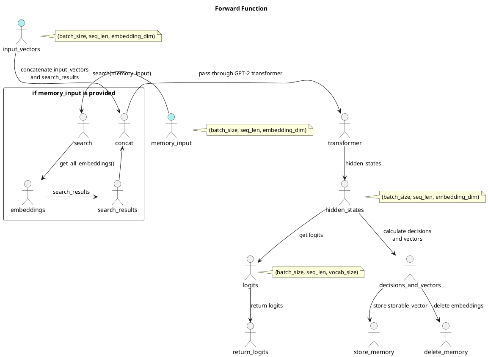

# VardaGPT

<!-- START doctoc generated TOC please keep comment here to allow auto update -->
<!-- DON'T EDIT THIS SECTION, INSTEAD RE-RUN doctoc TO UPDATE -->

- [VardaGPT](#vardagpt)
  - [Overview](#overview)
  - [Models](#models)
  - [Training, Evaluation, and Fine-tuning Process](#training-evaluation-and-fine-tuning-process)
    - [1. Data Preparation](#1-data-preparation)
    - [2. GPT-2 Model Adaptation](#2-gpt-2-model-adaptation)
    - [3. Training](#3-training)
    - [4. Evaluation](#4-evaluation)
    - [5. Fine-tuning (if necessary)](#5-fine-tuning-if-necessary)
  - [Prerequisites](#prerequisites)
  - [Setup](#setup)
  - [Directory Structure](#directory-structure)
  - [Usage](#usage)
    - [Data Preparation](#data-preparation)
    - [Training](#training)
    - [Evaluation](#evaluation)
    - [Inference](#inference)
  - [Contributing](#contributing)
  - [Code Formatting and Pre-commit](#code-formatting-and-pre-commit)
    - [Setup](#setup-1)
    - [Using Pre-commit](#using-pre-commit)
  - [License](#license)

<!-- END doctoc generated TOC please keep comment here to allow auto update -->

VardaGPT is a memory-enhanced GPT-2 model powered by Hugging Face Transformers
and FAISS. Inspired by J.R.R. Tolkien's Silmarillion, VardaGPT aims to provide
guidance and knowledge through its memory-augmented text generation
capabilities.

## Overview

<details>
  <summary>Click me</summary>


</details>


This diagram shows the main components of the VardaGPT project and their
interactions. The Data Preparation component processes the dataset and feeds it
to both the FAISS Memory Model and the GPT-2 Model Adaptation component. The
FAISS Memory Model generates embeddings, which are used by the GPT-2 Model
Adaptation component to create a modified GPT-2 model. The modified GPT-2 model
is then trained and evaluated, and the final trained model is used in the
Inference and Application component. The user provides the dataset and prompts
for text generation.

## Models

The associative memory model:

<details>
  <summary>Click me</summary>



</details>


<details>
  <summary>Click me</summary>


</details>


## Training, Evaluation, and Fine-tuning Process

<details>
  <summary>Click me</summary>


</details>


### 1. Data Preparation

- Collect and preprocess a dataset for training, evaluation, and fine-tuning.
- Split the dataset into training, validation, and testing sets.
- Create data loaders for handling data.

### 2. GPT-2 Model Adaptation

- Load a pre-trained GPT-2 model from Hugging Face Transformers.
- Modify the GPT-2 model architecture to incorporate the FAISS memory model.
- Define a custom loss function that considers both the GPT-2 model's output and
  the memory model.

### 3. Training

- Set up the training loop and train the adapted GPT-2 model.
- Save model checkpoints and track training metrics (loss, perplexity, etc.).
- Monitor the training progress, validate the model on the validation set, and
  perform early stopping if necessary.

### 4. Evaluation

- Evaluate the trained model on the testing set.
- Calculate evaluation metrics (e.g., perplexity, accuracy, F1-score).

### 5. Fine-tuning (if necessary)

- If the model's performance on the testing set is not satisfactory, fine-tune
  the model with different hyperparameters, learning rates, or architectures.
- Iterate through the training and evaluation steps until the desired
  performance is achieved.

## Prerequisites

- Python 3.6 or higher
- PyTorch
- Hugging Face Transformers
- FAISS (CPU or GPU version)

## Setup

1. Clone the repository:

```bash
git clone https://github.com/yourusername/VardaGPT.git
cd VardaGPT
```

2. Create and activate a virtual environment:

```bash
python -m venv venv
source venv/bin/activate
```

3. Install the required libraries:

```bash
pip install -r requirements.txt
```

## Directory Structure

- `src/`: Contains the Python source code for the project.
- `data/`: Stores the datasets used for training and evaluation.
- `models/`: Holds the trained models and their checkpoints.

## Usage

### Data Preparation

1. Place your dataset in the `data/` directory.
2. Preprocess and split your dataset into training, validation, and testing sets
   using the provided scripts in `src/`.

### Training

1. Configure the training settings and model hyperparameters in the
   `src/config.py` file.
2. Run the training script:

```bash
python src/train.py
```

3. Monitor the training progress and save model checkpoints in the `models/`
   directory.

### Evaluation

1. Evaluate the trained model on the validation and testing sets using the
   provided evaluation script:

```bash
python src/evaluate.py
```

### Inference

1. Use the provided inference script to generate text with the memory-enhanced
   GPT-2 model:

```bash
python src/inference.py --prompt "Your prompt text here"
```

## Contributing

Feel free to contribute to this project by submitting pull requests or opening
issues for bug reports and feature requests.

## Code Formatting and Pre-commit

This project uses `black`, `flake8`, and `mypy` for Python code formatting and
linting. We also use `prettier` to format JSON and Markdown files. The
configuration for these tools is in the `.pre-commit-config.yaml` file.

### Setup

1. Install `pre-commit` if you haven't already:

```bash
pip install pre-commit
```

2. Set up the git hooks:

```bash
pre-commit install
```

### Using Pre-commit

Whenever you commit changes, the pre-commit hooks will automatically format your
code and check for issues. If the hooks detect any problems, the commit will be
aborted, and you'll see a list of issues that need to be fixed. Once you've
resolved the issues, you can try committing again.

You can also run the pre-commit hooks manually on all files:

```bash
pre-commit run --all-files
```

Or run the hooks on specific files:

```bash
pre-commit run --files <file1> <file2>
```

By following this setup and using pre-commit hooks, you can ensure that the code
in the repository remains consistently formatted and adheres to the project's
coding standards.

## License

This project is licensed under the [MIT License](LICENSE).
